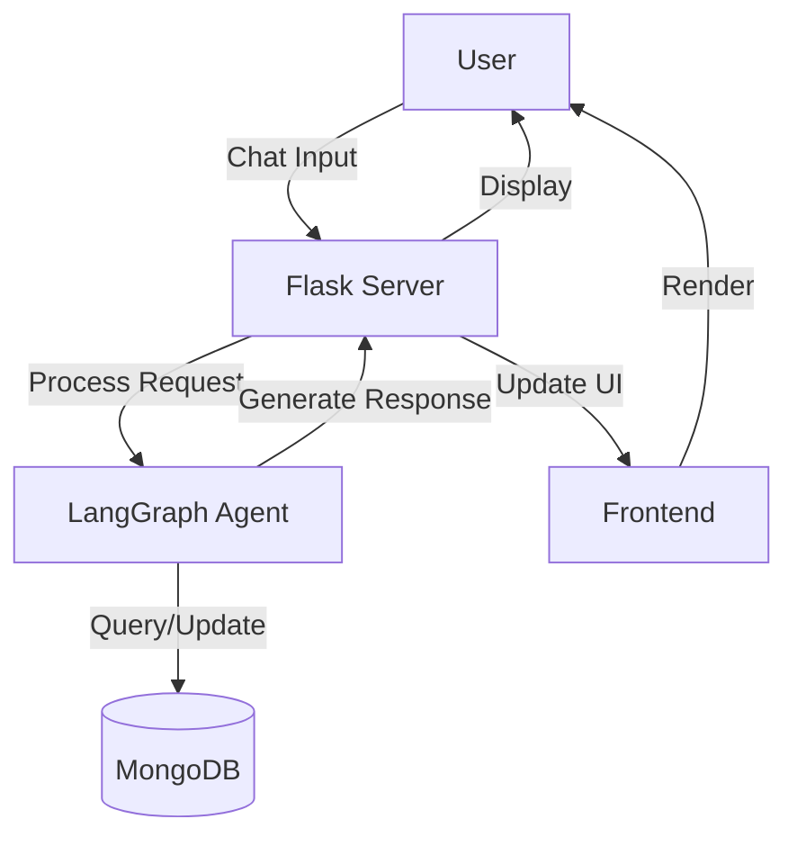

# Mindful Eating Agent

An AI-powered nutrition tracking application with a conversational interface that helps users log meals, track nutrition, and receive personalized recommendations.

## 📌 Table of Contents
- [Features](#-features)
- [Architecture](#-architecture)
- [Tech Stack](#-tech-stack)
- [Getting Started](#-getting-started)
- [API Endpoints](#-api-endpoints)
- [Development Workflow](#-development-workflow)
- [Deployment](#-deployment)
- [License](#-license)

## ✨ Features

### 🗣️ Conversational Interface
- Natural language food logging with AI understanding
- Handles typos and variations in food names
- Context-aware responses and suggestions
- Real-time nutrition feedback

### 📊 Nutrition Tracking
- Daily and weekly nutrition summaries
- Macro and micronutrient breakdown
- Progress visualization
- Personalized goal tracking

### 🤖 AI-Powered Insights
- Daily personalized suggestions
- Pattern recognition in eating habits
- Contextual recommendations
- Behavioral nudges

## 🏗️ Architecture



## 🛠️ Tech Stack

### Backend
- **Framework**: Flask 3.0
- **Language**: Python 3.10+
- **AI/ML**: LangGraph, LangChain
- **Database**: MongoDB 6.0+
- **Authentication**: Flask-Login

### Frontend
- **Core**: HTML5, CSS3, Vanilla JavaScript
- **Styling**: Custom CSS with Uber Eats-inspired design
- **Charts**: Chart.js

## 🚀 Getting Started

### Prerequisites
- Python 3.10+
- MongoDB 6.0+
- Node.js (for frontend development)

### Installation

1. **Clone the repository**
   ```bash
   git clone <repository-url>
   cd mindful-eating-agent
   ```

2. **Set up the backend**
   ```bash
   cd backend
   python -m venv venv
   venv\Scripts\activate  # Windows
   # source venv/bin/activate  # Linux/Mac
   pip install -r requirements.txt
   ```

3. **Set up MongoDB**
   - Ensure MongoDB is running locally on default port 27017
   - Or update the connection string in `config.py`

4. **Start the application**
   ```bash
   # Windows
   start-fullstack.cmd
   
   # Or manually
   python app.py
   ```

5. **Access the application**
   - Open http://localhost:5000 in your browser

## 🌐 API Endpoints

### Authentication
- `POST /login` - User login
- `POST /register` - Register new user
- `/logout` - Logout user

### Chat & Food Logging
- `GET /chat` - Chat interface
- `POST /api/chat` - Process chat messages
- `GET /api/chat-daily-suggestion` - Get daily AI suggestion

### Calendar & Analytics
- `GET /calendar` - Calendar view
- `GET /api/calendar-logs` - Get logs for calendar
- `GET /api/weekly-insight` - Get weekly insights

### Food Logs
- `POST /api/log-food` - Log food items
- `GET /api/today-logs` - Get today's food logs
- `GET /api/recent-logs` - Get recent logs

## 🔄 Development Workflow

### Code Structure
```
mindful-eating-agent/
├── backend/
│   ├── app.py                # Main Flask application
│   ├── agent_chat.py         # Conversational AI agent
│   ├── agent.py              # Original LangGraph agent
│   ├── utils/
│   │   ├── food_parser.py    # Food parsing logic
│   │   └── mongodb_client.py # Database operations
│   ├── static/
│   │   ├── css/style.css     # Main styles
│   │   └── js/
│   │       ├── chat.js       # Chat functionality
│   │       └── calendar.js   # Calendar functionality
│   └── templates/            # HTML templates
└── docs/
    └── README.md             # This file
```

### Development Commands

```bash
# Run the Flask development server
flask run

# Run with auto-reload
flask run --debug

# Run tests
pytest

# Format code
black .
flake8
```

## 🚀 Deployment

### Production
1. Set up a production WSGI server (Gunicorn, uWSGI)
2. Configure a reverse proxy (Nginx, Apache)
3. Set up MongoDB Atlas or a managed database
4. Configure environment variables:
   ```
   FLASK_ENV=production
   SECRET_KEY=your-secret-key
   MONGODB_URI=your-mongodb-uri
   ```

### Docker
```bash
# Build the image
docker build -t mindful-eating-agent .

# Run the container
docker run -d -p 5000:5000 --name mea mindful-eating-agent
```

## 📄 License

This project is licensed under the MIT License - see the [LICENSE](LICENSE) file for details.

## 🙏 Acknowledgments
- LangGraph and LangChain teams
- Flask and MongoDB communities
- OpenAI for language models
- All open-source contributors
